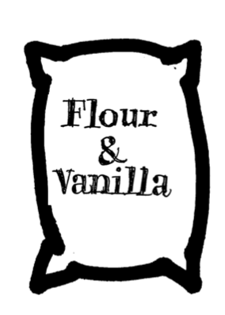
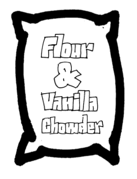
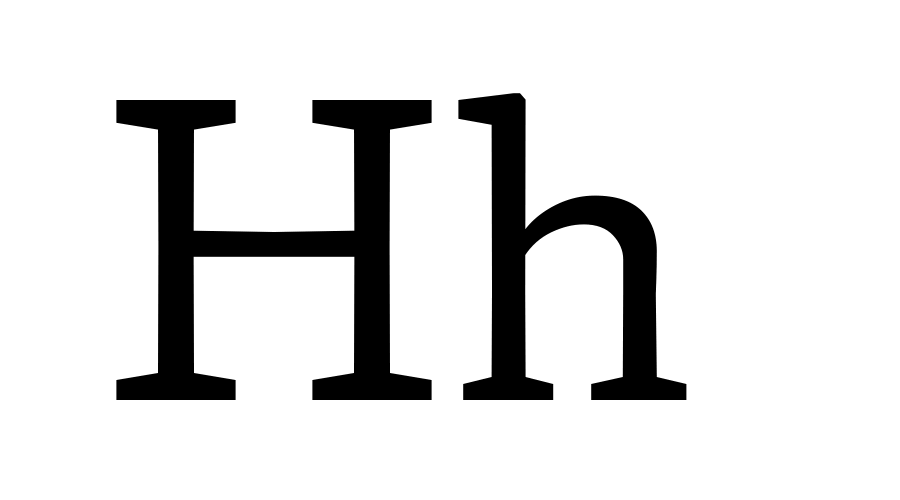
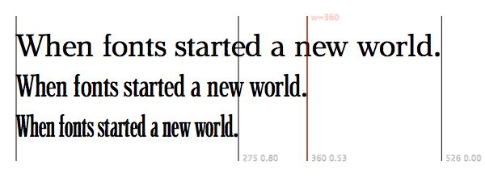
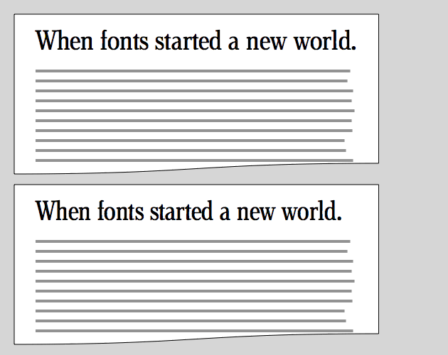

~~~Python
cid = 'Website'

# H O M E 

doc.title = 'Parametric Axes'
page = doc.newPage(title='Home', name='index.html', template='home')

doc.footerHtml = """Let us know what you think. Do you have any questions for us? <a href="mailto:info@designdesign.space?subject=Tell me more about Design Design Space">info@designdesign.space</a>
"""

box = page['Introduction']
~~~

#Parametric axes

A lot has already been written about the naming of axes in Variable Font, but creating standards and definintions about what they exactly do, is falling behind.

The reason for that is not a lack of interest, but that the current discussion is on the side with the most variable freedom and design choices exists.
A type designer can rightfully point out that a change in weight [wght] also implicates a change in width, but the amount depends on optical size, on the details of the design and on taste of the designer. 

The necessity and use of parametric axes in Variable Fonts can best be illustrated with other modular environments, such as the preparation of food.

####If the level of **Granularity** is a measure for flour to be used in certain kinds of bread, then the bakery would not expect an increasing amount of **Vanilla** to be mixed with that level.

####Chefs may never be able to agree on the exact ingredients, process and taste of the best **Chowder**, but most will agree that **Salt**, **Pepper** and **Potatos** are separate ingredients. Not to be used in a pre-ordered mixture.

To control the quality and behavior of any kind of product, the process of creation has to be broken down into modular behavior, to the least possible amount of independent parameters. 

A cook wants to use separate jars for **Flour** and **Vanilla**. And separate dispensers for **Pepper** and **Salt**, to mix them in exactly the right amount when using them.

####Specific combinations can be useful to save time in large volumes or when the ingedients interact, so their balance needs to be prepared. But even with such half products, the preparation still starts with the choice of separate ingredients.*

This guide was prepared in July 2017 for presentation to the public, the specification’s owners, and the OpenType Variations working group. Our goal is to record what we have learned about variable fonts and have put into practice, which we believe will be generally useful to the specification, and to propose a new, systematic approach to registering and using axes.

This proposal does not seek to classify the designs of typefaces parametrically, only what the values of the parameters are. Furthermore, it is offered as a beginning, suggesting the need for—but not containing—suggestions for many important attributes of non-Latin fonts.

The registration of the axes here is also intended to be used as part of a system including the registration of what function an axis performs for programs and/or users along the existing path from script selection to the rendered glyph in a document, aka the Mantra. Documentation of that part of the system, including the registration of what function an axis provides, is still in development and will follow soon.

The registration of the axes here is also intended to be used as part of a system including the registration of what function an axis performs for programs and/or users along the existing path from script selection to the rendered glyph in a document, aka the Mantra. Documentation of that part of the system, including the registration of what function an axis provides, is still in development and will follow soon.

~~~Python
box = page['Footer']
box.append(doc.footerHtml)

page = doc.newPage(title='Types', name='types.html', template='home')

box = page['Introduction']
~~~

## Types of axes

###A. Primary Type Axes
Type users are familiar with the attributes of a typeface family that combine to make up its appearance. Traditionally, these attributes are available as named and instantiated styles in font families. Some of these attributes are already recorded in fonts conforming to the OpenType v1.0 specification, as values in the OS/2 table, and in other tables of the SFNT format in general.

~~~Python
box = page['Main']['Side']
~~~

Today's font families contain instances pertaining to attributes of registered axes of OpenType, like width, weight, and optical size. In addition, some existing font families contain instances pertaining to grades, descender length, multiscript font mixing for different vertical proportions, and font families contain instances made for specific output, or with specific data to suite particular platform requirements.

~~~Python
box = page['Main']['Content']
~~~

This proposal is for a new and more complete set of typographic axes, with a unified value system, concern for non-Latin, responsive typography, compression, and more. The registration of a full set of attributes allows type developers to combine the modern, potentially much larger font family into a single file; it allows software developers and educators to have a clearer picture of how typography is shaped by the basic attributes; and it allows type users to control the attributes more precisely, whether that control is programmatic or manual via a user interface.

###B. Treatment Axes
Many treatments of typography—outlining or underlining, as well as adding drop shadows and more—are currently available to users via page description languages and applications, where only a uniform, size-independent transformation of all the glyphs of an instance is the result.

Because fonts usually provide a better solution than smearing regular type for “bold” or “obliquing” it for “italic,” and because optical size (the most common treatment of all) is a registered axis, variation axes can provide these and other treatments better than applications. This gives users more precise control per treatment, and per glyph, while also informing applications that these axes exist, and what their value systems are. It also relieves apps from having to provide the treatment, should the user desire to do so, with the font providing the means.

###C. Non-Latin Axes
Today’s multiscript type designer faces two major options when mixing more than one script in a typeface family: to compromise one or both scripts to the ideals of the other; or, alternatively, to make multiple instances of the font to provide uncompromised versions of each.

The compromises occur in all of the typographic parameters listed in A. Primary Type Axes, and surface in the choices that need to be made in presenting a unified appearance of width, weight, and height among glyphs of different scripts. These compromises come in a variety of sizes, from small (as when Latin and Cyrillic need to work together) to large (as when Chinese and Arabic have to work together). And, of course, there are the supersized compromises in OS fonts, where the typeface family contains fifty-three scripts.

In these scenarios, the type developer is challenged to come up with a single harmonious solution, per size, to the weights and widths of each glyph, in order to form the correct relationship between transparent and opaque across all of the glyphs of the scripts involved. If users don’t like the type designer’s solutions, they are free to roam the width and weight axes and either programmatically or manually redefine the interscript solutions to weight and width. It’s important to understand that this option is open to the type developer and user without script-specific opaque and transparent attributes, because the proper weight and width per style are solvable in the hands of developers and users without registered weight axes for every script.

Alignments operate differently in typography. So in variable fonts, they must be able to operate independently of one another at any given weight, width, and size, ahead of whatever decisions occur in those attributes. Until now, all of the scripts of Unicode have shared what could be read as Latin alignments in the OpenType spec.

This proposal does not prevent type developers from continuing to share one set of registered alignments among all the scripts of Unicode. Rather, it suggests that if variable font developers want to maintain compression, performance, and quality in multiscript design, then registered axes for the alignments specific to each script are required. And Chinese alignment values that are definable independently of Latin alignment values are a good place to start.

###D. Motion Axes
The essence of designing realistic motion in media with variable fonts requires giving users and programs a simple solution to the following equation: Distance = Rate × Time. The proposed axes enable type developers to define the distances their animations move per cycle of animation, so motion-graphics designers can solve this equation relative to size of use without trial and error on each glyph.

As variations will undoubtedly be put to the task of animation, these axes create a common meeting point between design and use.

###E. Glyph Axes
The existing OpenType specification allows composites—i.e., reference from a glyph to use another glyph, possibly repositioned or otherwise transformed—to save space and time when developing fonts that repeatedly use the same shape.

In traditional typefounding, a font developer would not hesitate to create fractions by using a glyph from a smaller master of the same style. In variable fonts, using the same contours of a glyph repeatedly (with deltas for weight, width, and optical size) opens up the possibility of using those and other instances for many such purposes, but only if the developer can pinpoint the instance location ​​of particular glyphs, or glyphs of a particular feature, along a registered axis.

###F. Composite Axes
Composite Axes combine 2 or more primary axes or other composite axes. There are several reasons why the type designer decides to add a composte axis to the Variable Font.

* The Composite Axis refer to a common understanding about the usage. The traditional weight axis **[wght]** most often changes weight width and contrast at the same time, also in relation to the setting of the optical size **[opsz]** axis. 
* The composite axis can be used to optimize, compensate or redefine the result of combined primary axes. 

~~~Python
page = doc.newPage(title='Primary', name='primary.html', template='home')

box = page['Introduction']
~~~

## Primary axes
Definitions and recipes

~~~Python
box = page['Main']['Content']
~~~

###xtra

* **Tag** xtra
* **Name:** x transparent
* **Type:** Primary axis
* **Description:** Assigns a “white” per mille value to each instance of the design space, by changing the counters.
* **Recipe:** Counter width varies. Axis value scales the width of counters, if they exist. Stems and side-bearings are constant.  Outline points within the vertical projection of counters interpolate between the counter edges. Points outside the projection of counters just move relative. Component positions and their outlines behave as decomposed points.
* **Valid numeric range:** -1000 to 2000
Scale interpretation: values can be interpreted as per-mille-of-em. Note that with this range, counters are valid to get negative width.
* **Recommended “normal” value:** sample value 400
* **Suggested programmatic interactions:**
* **Suggested user interactions:**
* **Related axis information:**

###xopq

* **Tag:** xopq
* **Name:** x opaque
* **Type:** Primary axis
* **Description:** Assigns a “black” per mille value to each instance of the design space.
* **Recipe:** Stem width varies. Counter widths, if they exist, and side-bearings are contant. Outline points within the vertical projection of stems interpolate between the middle of stems. Points outside the projection of stems just move relative. Component positions and their outlines behave as decomposed points.
* **Valid numeric range:** -1000 to 2000
* **Scale interpretation:** values can be interpreted as per-mille-of-em. The minimum value is also defined so that stems don’t get negative width.
* **Suggested programmatic interactions:**
* **Suggested user interactions:**
* **Related axis information:**

###xtrk

* **Tag:** xtrk
* **Name:** x tracking
* **Type:** Primary axis
* **Description:** assigns a “white” per mille value to both side-bearings for each instance of the design space.
* **Recipe:** Counter widths, if they exist, and stems are contant. The axis value is added to the side-bearings on both sides, so the netto increase in with is double the axis amount.
* **Valid numeric range:** -1000 to 2000
* **Scale interpretation:** Values can be interpreted as per-mille-of-em. The minimum value is also defined so that stems don’t get negative width.
* **Suggested programmatic interactions:**
* **Suggested user interactions:** Change distance between glyphs, only affecting the total width. Weight counters and vertical metrics don't change, while that be room for extending serif length and position of connecting strokes. The behavior of this axis is comparable with the tracking in a page-layout program. Here it allows the design to change the glyph shape (e.g. touching script glyphs) if necessary.
* **Related axis information:**

###ytra

* **Tag:** ytra
* **Name:** y transparent
* **Type:** Primary axis
* **Description:** Assigns a “white” per mille value to each instance of the design space, by changing the vertical counters.
* **Recipe:** Vertical counter width varies. Axis value scales the width of vertical counters, if they exist. Bars are constant.  Outline points within the vertical projection of counters interpolate between the counter edges. Points outside the projection of counters just move relative. Component positions and their outlines behave as decomposed points.
* **Valid numeric range:** 0 to 2000
* **Scale interpretation:** Values can be interpreted as per-mille-of-em
* **Recommended “‘normal”’ value:** Sample value 884
* **Suggested programmatic interactions:**
* **Suggested user interactions:**
* **Related axis information:**

###yopq

* **Tag:** yopq
* **Name:** y opaque
* **Type:** Primary axis
* **Description:** Assigns a “white” per mille value to each instance of the design space, by changing the vertical counters.
* **Recipe:** Bar width varies. Vertical counter heights, if they exist contant. Outline points within the vertical projection of stems interpolate between the middle of stems. Points outside the projection of stems just move relative. Component positions and their outlines behave as decomposed points.
* **Valid numeric range:** -1000 to 2000
* **Scale interpretation:** Values can be interpreted as per-mille-of-em
* **Recommended “‘normal”’ value:** Sample value 116
* **Suggested programmatic interactions:**
* **Suggested user interactions:**
* **Related axis information:**

###ytlc

* **Tag:** ytlc
* **Name:** y transparent lowercase
* **Type:** Primary axis
* **Description:** assigns a “white” per mille value to each instance of the design space
* **Recipe:** Stem width varies. Counter widths, if they exist, and side-bearings are contant. Outline points within the vertical projection of stems interpolate between the middle of stems. Points outside the projection of stems just move relative. Component positions and their outlines behave as decomposed points.
* **Valid numeric range:** 0 to 1000
* **Scale interpretation:** Values can be interpreted as per-mille-of-em
* **Recommended “normal” value:** Sample value, 500
* **Suggested programmatic interactions:**
* **Suggested user interactions:**
* **Related axis information:**

###ytuc

* **Tag:** ytuc
* **Name:** y transparent uppercase
* **Type:** Primary axis
* **Description:** a “white” per mille value for each uppercase height in the design space
* **Recipe:** Stem width varies. Counter widths, if they exist, and side-bearings are contant. Outline points within the vertical projection of stems interpolate between the middle of stems. Points outside the projection of stems just move relative. Component positions and their outlines behave as decomposed points.
* **Valid numeric range:** -1000 to 1000
Scale interpretation: values can be interpreted as per-mille-of-em
* **Recommended “normal” value:** sample value 725
* **Suggested programmatic interactions:**
* **Suggested user interactions:**
* **Related axis information:**

###ytde

* **Tag:** ytde
* **Name:** y transparent descender
* **Type:** Primary axis
* **Description:** assigns a “white” per mille value to each instance of the design space
* **Recipe:** Stem width varies. Counter widths, if they exist, and side-bearings are contant. Outline points within the vertical projection of stems interpolate between the middle of stems. Points outside the projection of stems just move relative. Component positions and their outlines behave as decomposed points.
* **Valid numeric range:** -1000 to 0
* **Scale interpretation:** values can be interpreted as per-mille-of-em
* **Recommended “normal”** value: sample value -250
* **Suggested programmatic interactions:**
* **Suggested user interactions:**
* **Related axis information:**

###ytas

* **Tag:** ytas
* **Name:** y transparent ascender 
* **Type:** Primary axis
* **Description:** assigns a “white” per mille value to each instance of the design space
* **Recipe:** Stem width varies. Counter widths, if they exist, and side-bearings are contant. Outline points within the vertical projection of stems interpolate between the middle of stems. Points outside the projection of stems just move relative. Component positions and their outlines behave as decomposed points.
* **Valid numeric range:** 0 to 1000
* **Scale interpretation:** values can be interpreted as per-mille-of-em
* **Recommended “normal” value:** sample value 750
* **Suggested programmatic interactions:**
* **Suggested user interactions:**
* **Related axis information:**

~~~Python
page = doc.newPage(title='Composites', name='composites.html', template='home')

box = page['Introduction']
~~~

#Composite axes

## Registered axes

###wght

* **Tag:** wght
* **Name:** weight 
* **Type:** Composite axis (registered)
* **Included primary axes:** 
* **Description:** assigns a “white” per mille value to each instance of the design space
* **Recipe:** Follows the “traditional” weight axis, which may includes change of stem width, counters and margins and vertical heights. All measures depend on the selected optical size.
* **Valid numeric range:** 0 to 1000
* **Scale interpretation:** Matching the OS/2 range, values can be interpreted as discreet increments of 1.* **Recommended “normal” value:** sample value 750
* **Suggested programmatic interactions:**
* **Suggested user interactions:** User wants to change the weight with the emphasis on maintaining the estetics of the shape, or to keep close to the original non-Variable instances of the design. There are no requirements on changing width or any other parameter. Shape and spacing is dependend on the selected optical size.
* **Related axis information:**
* **Included primary axes:** *[xtra]*, *[xopq]*, *[xtrk]*, *[ytra]*, *[yopq]*. And possibly also *[ytlc]*, *[ytuc]*, *[ytde]*

###wdth

* **Tag:** wdth
* **Name:** width 
* **Type:** Composite axis (registered)
* **Description:** Assigns a width per mille value to each instance of the design space. This c
* **Recipe:** Follows the “traditional” width axis, which may include change of stem width, counters and margins and vertical heights. All measures depend on the selected optical size.
* **Valid numeric range:** 0 to 10. 
* **Scale interpretation:** Matching the OS/2 range, values can preferably be interpreted as increments of 100. 
* **Recommended “normal” value:** sample value 400
* **Suggested programmatic interactions:**
* **Suggested user interactions:** User wants to change the width with the emphasis on maintaining the estetics of the shape, or to keep close to the original non-Variable instances of the design. There are no requirements on changing weight or any other parameter. Shape and spacing are dependend on the selected optical size.
* **Related axis information:**
* **Included primary axes:** Use all parametric axes to compensate for weight change, especially when compressing.  *[xtra]*, *[xopq]*, *[xtrk]*, *[ytra]*, *[yopq]*. And possibly also *[ytlc]*, *[ytuc]*, *[ytde]*

###opsz

* **Tag:** opsz
* **Name:** optical size 
* **Type:** Composite axis (registered)
* **Description:** Make the appearance of the characters similar, indpendent of their opticals size. This compensates for absoute and visual weight change, contrast change, smallest details that can be displayed, vertical metrics and spacing.
* **Recipe:** Use the metrics of original sizes if they exists. Otherwise make adjustments based on 
* **Valid numeric range:** 8 - 72
* **Scale interpretation:** Values can be interpreted as per-mille-of-em
* **Recommended “normal” value:** 14
* **Suggested programmatic interactions:**
* **Suggested user interactions:** The settings of this axis should be invisible to the user. The size selection in the page-layout application with set the value.
* **Related axis information:**
* **Included primary axes:** Show optimized for optical size, where the resulting change in absolute weight and width is not important. *[xtra]*, *[xopq]*, *[xtrk]*, *[ytra]*, *[yopq]*. And possibly also *[ytlc]*, *[ytuc]*, *[ytde]*

## Unregistered

###lead

* **Tag:** lead
* **Name:** Leading 
* **Type:** Composite axis 
* **Description:** Make the appearance of the characters similar, indpendent of their opticals size. This compensates for absoute and visual weight change, contrast change, smallest details that can be displayed, vertical metrics and spacing.
* **Recipe:** Use a the vertical primary axis to define the height of x-height, capital, asdender and descender, to fill the space between lines of text. 
* **Valid numeric range:** 
* **Scale interpretation:** * **Recommended “normal” value:** 
* **Suggested programmatic interactions:**
* **Suggested user interactions:**
* **Related axis information:**
* **Included primary axes:** Show optimized for optical size, where the resulting change in absolute weight and width is not important. *[xtra]*, *[xopq]*, *[xtrk]*, *[ytra]*, *[yopq]*. And possibly also *[ytlc]*, *[ytuc]*, *[ytde]*

###grad

* **Tag:** grad
* **Name:** Grade 
* **Type:** Composite axis 
* **Description:** Change the weight, while keeping all width the same. 
* **Recipe:** Use a combination of *[xtra]* and *[xopq]* to change the width of stems, while compensating the total width by changing the counters.   
* **Valid numeric range:** 18
* **Scale interpretation:** Values can be interpreted as per-mille-of-em
* **Recommended “normal” value:** sample value 750
* **Suggested programmatic interactions:**
* **Suggested user interactions:**
* **Related axis information:**
* **Included primary axes:** Show optimized for optical size, where the resulting change in absolute weight and width is not important. *[xtra]*, *[xopq]*, *[xtrk]*, *[ytra]*, *[yopq]*. And possibly also *[ytlc]*, *[ytuc]*, *[ytde]*

~~~Python
page = doc.newPage(title='Usage', name='usage.html', template='home')

box = page['Introduction']
~~~

##Use cases

###Weight change without width change

###Width change without weight change

###Contrast change without width change

###Adapt part of headlines (e.g. stems and bars) to elements in a page layout

### Animated glyphs

### Predictable shadow handling

### Match Latin with non-Latin and visa versa

### Adjustable smallcaps

### Various sets of figures.